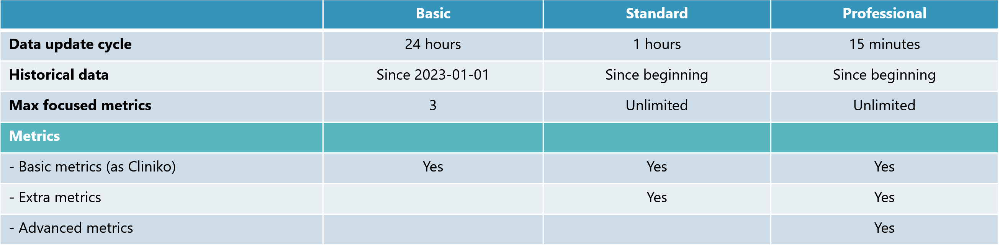
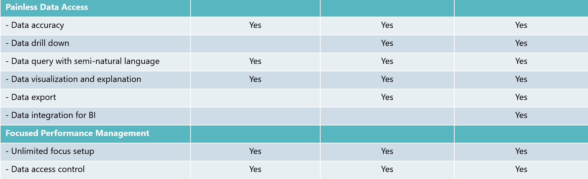
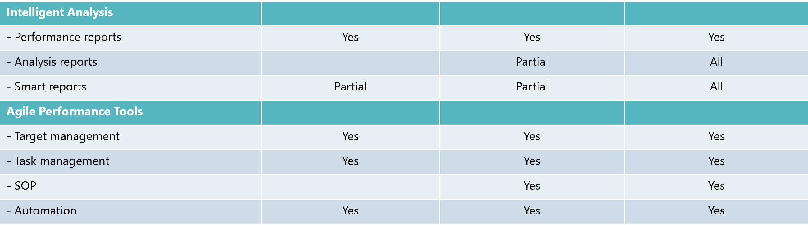
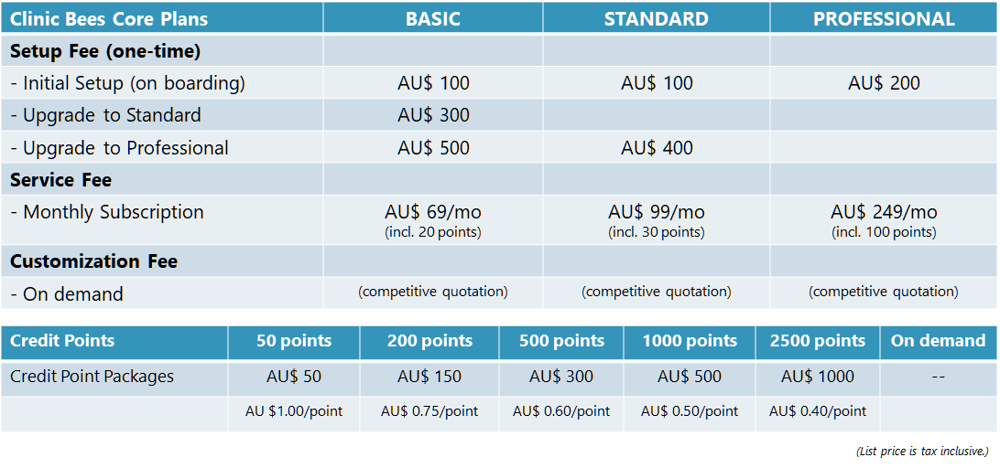

# Welcome to Clinic Bees!

  

## Introduction

_**Clinic Bees**_ is a practitioner performance management solution.
It's seamlessly integrating Cliniko and Slack, ones among best practice management software and
productivity platforms, to enable improvement of your clinic service and business by
inspiring each practitioner and team with agile performance management cycles automatically,
so that you could not only understand current performance, but also find out problems and causes,
and help your practitioners to improve their performance.

Do you have below problems in your mind to operate the clinic?
If so, _**Clinic Bees**_ is offering the right solution for you.

>[!WARNING|style:flat|label:|icon:fa-regular fa-face-frown]
_“I have invested the great practice management software (such as Cliniko), it is with all the functionalities to manage the clinic from different perspectives.  However, it’s not providing insights of individuals or teams for regular performance management.”_

>[!WARNING|style:flat|label:|icon:fa-regular fa-face-frown]
_“As clinic owner, I have to spend a lot of time to manage my people while I still need to meet with patients and offer the services.  To hire dedicate people managers doesn’t make sense by considering my business size and cost.”_

>[!WARNING|style:flat|label:|icon:fa-regular fa-face-frown]
_“It’s always a difficult job for me to have performance communication with individuals.  Frequency, feedback and fairness are always tricky in real practice to make sure message will be accurately delivered.”_

## Key Features

* **Painless Data Access**
  * Data accuracy and transparency
  * Data query with semi-natural language
  * Data visualization and explanation
  * Data export and integration

* **Foused Performance Management**
  * Unlimited focus setup (practitioners and metrics)
  * Data access control

* **Intelligent Analysis**
  * Performance reports
  * Analysis reports
  * Smart reports

* **Agile Performance Tools**
  * Target management
  * Task management
  * SOP
  * Automation

## Why choose Clinic Bees

* **Ease of Use**
  * Slack based user interface
  * Semi-natural language based command system (English)
  * Friendly messages and documentations

* **Data Security and Privacy**
  * All clinic data is hosted on clinic's own private cloud
  * No patient privacy data
  * Data permission/access is transparent

* **Low Cost**
  * Low adoption cost
  * Low fixed cost
  * Pay as you go

## Plans

There are 3 different plans of _**Clinic Bees**_ to meet the different requirements of different clinics.

* **Basic Plan**

  This is the plan with basic functionality of the performance management.

  It's good starting point of small clinics with casual performance management needs while want to get performance data access easier.

* **Standard Plan**

  This is the plan with full functionality of the performance management.

  It's good fit to variety of clinic sizes who want to better manage their practitioners and drive better business results.

* **Professional Plan**

  This is the plan with extra functionality beyond performance management.

  It's for those want to build data driven businesses, and have better management on risks and forecast in business operations.

>[!NOTE]
You need to carefully select the plan initially to best meet your needs.  
Although we support late upgrade, it's with extra cost and breaking time of service for migration.

## Pricing

