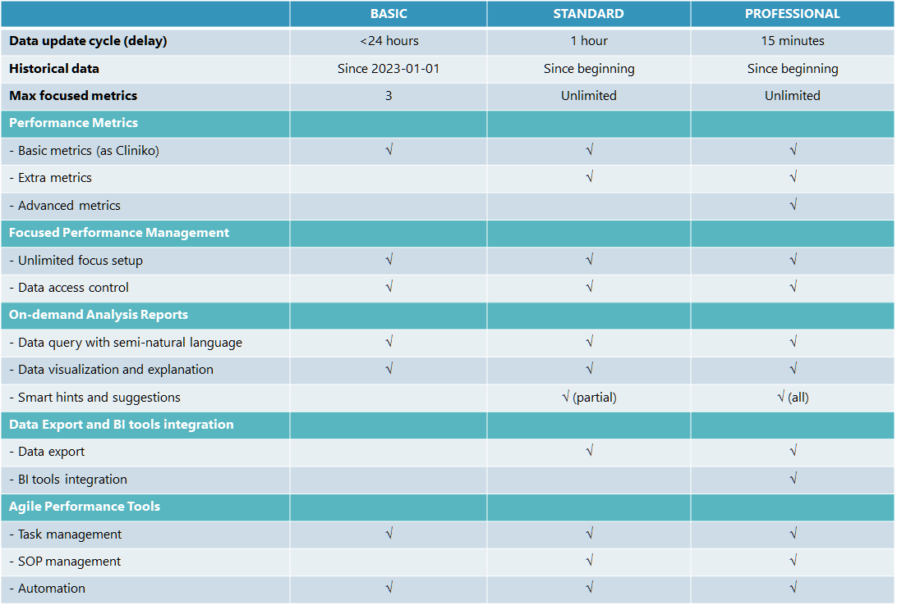

# Welcome to Clinic Bees!

  

## Introduction

**Clinic Bees** is a productivity solution for practitioners and healthcare providers growth.

**Clinic Bees** is a virtual assistant that empowers practitioners and teams to achieve growth
with its built-in agile tools and automation. It allows you and your team to track performance anytime, anywhere, 
and identify issues and their causes through intelligent analysis. 
Then it helps you and your team continuously improve and grow.

**Clinic Bees** integrates seamlessly with Slack and your existing practice management system, 
allowing for easy adoption in your current workflow, maximizing the value of your existing data, 
and optimizing your investment in systems.

Do you have below problems in your mind to operate the clinic?
If so, **Clinic Bees** is offering the right solution for you.

>[!WARNING|style:flat|label:|icon:fa-regular fa-face-frown]
_“I have invested the great practice management software (such as Cliniko), it is with all the functionalities to manage the clinic from different perspectives.  However, it’s not providing insights of individuals or teams for regular performance management.”_

>[!WARNING|style:flat|label:|icon:fa-regular fa-face-frown]
_“As clinic owner, I have to spend a lot of time to manage my people while I still need to meet with patients and offer the services.  To hire dedicate people managers doesn’t make sense by considering my business size and cost.”_

>[!WARNING|style:flat|label:|icon:fa-regular fa-face-frown]
_“It’s always a difficult job for me to have performance communication with individuals.  Frequency, feedback and fairness are always tricky in real practice to make sure message will be accurately delivered.”_

## Key Features

**Clinic Bees** offers a set of features with intuitive and friendly interface to make it a useful and helpful assistant for you. 

* Focused Performance Management

* On-demand Analysis Reports

* SOP Management

* Task Management

* Automation

* Data Export and BI tools integration

* Integration with Practice Management Software

* Slack chatting based interface with semi-natural language

## Why Choose Clinic Bees

:fas fa-check: **Ease of Use**

  Chat with your assistant naturally to easily complete your tasks.

:fas fa-check: **Data Transparency and Accuracy**

  All data metrics, from definitions to visualizations, accurately reflect your actual operations 
	with complete traceability, ensuring transparency and confidence in your decision-making.

:fas fa-check: **Data Security**
  
  Protect your business data from the foundation up with a dedicated and isolated 
	system architecture, ensuring complete isolation of patient privacy data and business data
	for ultimate security and privacy.

:fas fa-check: **Manageable Cost**

  Low learning cost, low adoption and fixed cost, pay as you go.

## Plans

**Clinic Bees** provides 3 plans to meet the diverse needs of your business.

* Basic Plan
  
  This plan offers basic performance management functionality, making it a great fit for small clinics 
  with informal performance management needs who want to access performance data more easily.

* Standard Plan

  This plan provides all the tools necessary for clinics of all sizes to effectively manage 
  individual and team performance, ultimately driving improved business outcomes.

* Professional Plan
  
  Beyond performance management, it goes further by offering advanced functionality that fuels
  the growth of teams and businesses. This makes it ideal for organizations striving to build 
  data-driven cultures and systems, effectively manage risks, and gain deeper insights for future planning.

**Comparison of Plans**

## Pricing

Your cost on **Clinic Bees** is 100% manageable.  Base on the plan you chose,
monthly subscription fee will extend the period of service.  You may cancel your subscription at anytime.
Some functions need to be paid with credit points.  In your monthly subscription, it has already included
the credit points for typical usage.  If you need more, you may buy extra credit points.
Most of functions are free to be used.

**Clinic Bees** runs on an isolated, secure system built just for your team and business. 
This secure setup requires an initial setup fee to ensure your data is always safe.
Upgrading your plan requires migrating your existing data to a new, customized system.
To prevent service interruptions and additional costs, we recommend choosing your plan carefully.

Your feedback and ideas on how to improve **Clinic Bees** or customize it are always welcome.
We offer competitive pricing and rewarding programs for contributors. Please contact us to learn more.

