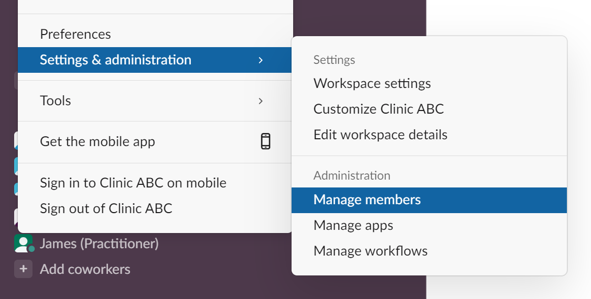

## User Roles

After system is setup for an account, all users on Slack workspace is able to access the service.
There are 3 different roles, and one user is with one specific role at a time based on the configuration
by owner:

* **Owner role**

This is basically the owner of the Slack workspace and the system.
System will automatically detect the owner from Slack workspace.
The Primary Workspace Owner will be assumed the Owner of the **Clinic Bees** system for this workspace as well.

>[!TIP]
>Check Slack workspace members via Administration/Manage members to see full user list of the workspace.

* **Admin role**

This is a role with permissions to access everyone's data and access to some settings.
Owner could delegate some users with Admin role, so that Admin users could share some duties with Owner
and help Owner to manage the whole system.

Owner could [assign](reference/commands_sys.md#assign-admin) or 
[revoke](reference/commands_sys.md#revoke-admin) the Admin users.

* **User role**

If a user is neither in Owner role nor in Admin role, then it's a general user role.