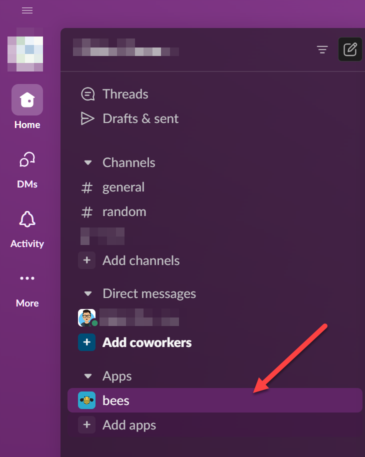

## Basic of Command

You interact with _**Clinic Bees**_ system with **commands**.

The command is a message sent in a **public channel** with "bees" invited and with tag to **@bees** at
very beginning (or ending).

For example:
```text
@bees list-practitioners
```
Or it is a message sent to **bees** directly on Slack.
When the command is sent directly to **bees**, the tag is optional.

For example:
```text
list-practitioners
```

>[!TIP]
>Since the name of **bees** is customizable for each clinic, please check the name
of bees setup on your system, and tag to the correct one when sending commands.


The general command syntax is as below:

```text
@bees <command keyword> <parameters>
```

`<command keyword>` is to specify the purpose of the command.

`<parameters>` is the parameters of the command.  Each command has different set
of parameters, or no parameter is needed.

For the syntax of each command, please take reference to the documents on this site.

>[!NOTE]
>Are you worrying to follow the restrict rule of command syntax as other systems?
>
>Don't worry about that!  _**Clinic Bees**_ is using semi-natural language
>interpretation system to read your command, so as far as you could provide the right `<command keyword>`,
>it will try to interpret your needs with natual language.
>
>For example, if you feel below command is boring:
>```text
>@bees assign-admin @Ana @Janet
>```
>Then you may want to send below message with command in the #general channel
>as an annoucement to your team.
>```text
>@bees assign-admin I'm assigning @Ana and @Janet become admins of the system.
>```
>
>In the documentation, we will give the basic syntax of each command.
>Feel free to explore your way to specify the parameters and send the message to **@bees**.
>
>We officially support **English only** now.

When you sent a command, **bees** will typically give a response shortly with reactions.
And the result will be either reported in reactions or with messages responded.
If there is no response to the command, please retry.  If you still can not get
any response from **bees**, please contact customer support.

## How to read

The documentation of commands are indexed with the `<command keyword>` and grouped by
the functionalities.

For each command, it typically includes below parts:

* **Description**

  Introduction of the command use cases.

* **Syntax**
  
  Basic syntax of the command.  As it's enhanced by semi-natural language
  interpretation system, so it's not a restricted syntax.  
  You may explore your own language to send the command based on this basic syntax.

* **Example**

  Example(s) of the command.

* **Availability**

  This is to show the command availability by [plan options](../README.md/#plans).
  You will get error message if you are sending a command not available on your plan.
  (Basic/Standard/Professional)

* **Roles Permission**

  This is to show the command availability by [user roles](../basic.md/#user-roles).
  You will get error message if you are sending a command not available for your role.
  (Owner/Admin/User)

* **Call Place**
  
  This is to specify where you could send command to.

  Some commands could be specifically called in direct message to _**bees**_ (as below) for security or privacy consideration.
  For example, when installing cliniko or checking the account status, these commands could be called
  in direct message only.

  

  Some commands are designed to be called in public channels.  For example, as focused performance management
  is based on the Slack public channels, so related commands could be sent in public channels only.

>[!TIP]
Some commands could be called in both direct message or public channel, but please be noted
that the tagged user will not be notified in direct message.  So we stronly suggest you to send commands
in public channels for most of cases, so that actions could be transparent and result could be shared
with your teammates.

* **Cost of Credit Points**

  This is the credit points to be consumed if a command is successfully executed.
  If there is no enough credit points remained in your account, you will get error
  message and the command will not be executed.


