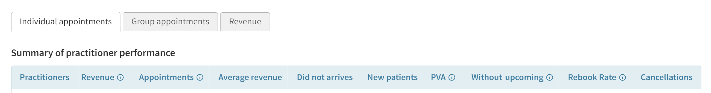
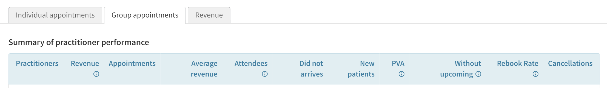
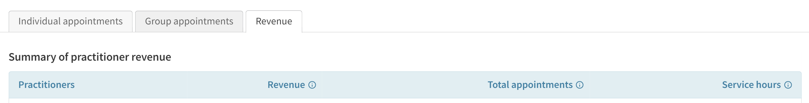

## Basic of Metrics

Metrics are the specific data you may interest in to manage your clinic business operation.

_**Clinic Bees**_ offers a comprehensive set of metrics not only the standard ones which you could
obtain in Cliniko, but also the extra ones that provides more dimensions or deeper insights
for analysis purpose.

You could select the right metrics set for right group of practitioners, so that you
may have the best focus on management and get the best and most cost effective result.

As what Cliniko does, the metrics are roughly grouped in:

* **Individual appointment related**

The metrics are linking to individual appointment activities.

You may use the metrics to analyze the patients, workload, consumables, workflow
(patient experience) and revenue, so that you could focus on specific domain for your clinic.

All metrics could be filtered by practitioners, businesss/locations, appointment types 
and service types.  And data could be viewed in daily, weekly, monthly, quarterly or yearly
for specific period as you defined.

* **Group appointment related**

The metrics are linking to group appointment activities.

* **Revenue related**

The metrics are from the general finance perspective.

With these metrics, you may not only get summary of your business booked on Cliniko, but also
the drilled down view to show the revenue stream to your business.

They are with the same filter options and view options as other metrics.

## How to migrate from Cliniko

_**Clinic Bees**_ is covering all the metrics which Cliniko provides for practitioner
management in especially the ones in practitioners performance report.

For Cliniko's metrics definition, you may read
[Understanding the practitioner performance report](https://help.cliniko.com/en/articles/4260984-understanding-the-practitioner-performance-report)
which should be the official document to explain them.

However, some of cliniko's metric definitions are known inaccurate to some practices
in real clinic operations.  So for kind of cases, we defined different metrics to 
meet the different needs.  

For example, we have defined **[ia_arev_cliniko](reference/metrics_ia.md#ia_arev_cliniko)**
and **[ia_arev](reference/metrics_ia.md#ia_arev)** which are both for the appointment revenue
from individual appointments.  But the previous one is with exactly same formula as Cliniko
that it ignores the other revenue from cancellations or rescheduing while it does happen 
in some clinics.  So you may choose later one if you do care the accuracy of numbers
in your business.

Here is a quick mapping for practitioners performance report.

**Individual appointments**

1. Revenue - [ia_arev_cliniko](reference/metrics_ia.md#ia_arev_cliniko)
2. Appointments - [ia_attended](reference/metrics_ia.md#ia_attended) | [ia_attended_rate](reference/metrics_ia.md#ia_attended_rate)
3. Average revenue - [ia_arev_average_cliniko](reference/metrics_ia.md#ia_arev_average_cliniko)
4. Did not arrives - [ia_dna](reference/metrics_ia.md#ia_dna) | [ia_dna_rate](reference/metrics_ia.md#ia_dna_rate)
5. New patients - [ia_np](reference/metrics_ia.md#ia_np) | [ia_np_rate](reference/metrics_ia.md#ia_np_rate)
6. PVA - [ia_pva](reference/metrics_ia.md#ia_pva)
7. Without upcoming - [ia_without_upcoming](reference/metrics_ia.md#ia_without_upcoming)
8. Rebook Rate - [ia_rebook_rate](reference/metrics_ia.md#ia_rebook_rate)
9. Cancellations - [ia_cancelled](reference/metrics_ia.md#ia_cancelled)    

**Group appointments**

1. Revenue - [ga_arev_cliniko](reference/metrics_ga.md#ga_arev_cliniko)
2. Appointments - [ga_total](reference/metrics_ga.md#ga_total)
3. Average revenue - [ga_arev_average_cliniko](reference/metrics_ga.md#ga_arev_average_cliniko)
4. Attendees - [ga_attended](reference/metrics_ga.md#ga_attended) | [ga_attended_rate](reference/metrics_ga.md#ga_attended_rate)
5. Did not arrives - [ga_dna](reference/metrics_ga.md#ga_dna) | [ga_dna_rate](reference/metrics_ga.md#ga_dna_rate)
6. New patients - [ga_np](reference/metrics_ga.md#ga_np) | [ga_np_rate](reference/metrics_ga.md#ga_np_rate)
7. PVA - [ga_pva](reference/metrics_ga.md#ga_pva)
8. Without upcoming - [ga_without_upcoming](reference/metrics_ga.md#ga_without_upcoming)
9. Rebook Rate - [ga_rebook_rate](reference/metrics_ga.md#ga_rebook_rate)
10. Cancellations - [ga_cancelled](reference/metrics_ga.md#ga_cancelled)

**Revenue**

1. Revenue - [rev_total](reference/metrics_rev.md#rev_total)
2. Total appointments - [appointments_total](reference/metrics_rev.md#appointments_total)
3. Service hours - [service_hours_total](reference/metrics_rev.md#service_hours_total)

## Availability

Depending on your plan, some metrics may not be available on your system.
Please take reference to the documents on this site to get the availability of each metric.

>[!NOTE]
Since our command system is a semi-natural language system, so as far as the metric
is not available on your system, it may not always give you appropriate error message
as it could be recognized as your own language but not a metric.